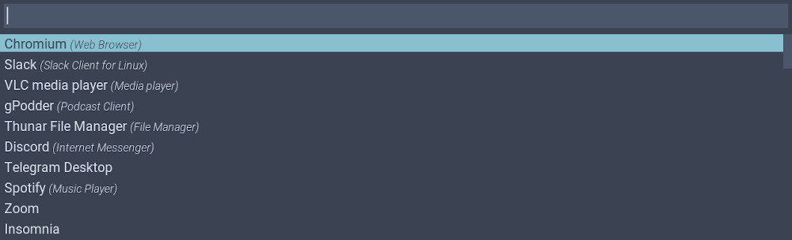

# Nord Rofi Theme

A [Rofi](https://github.com/davatorium/rofi) theme based on [Nord](https://github.com/arcticicestudio/nord) theme by Arctic Ice Studio.



## Getting Started

### Installation

Copy nord.rasi to the rofi configuration themes directory at ~/.config/rofi/themes.

```sh
mkdir -p ~/.config/rofi/themes
curl -o ~/.config/rofi/themes/nord.rasi https://raw.githubusercontent.com/amayer5125/nord-rofi/master/nord.rasi
```

Then add the following line to your [rofi configuration](https://github.com/davatorium/rofi/wiki/Configuring-Rofi) file, usually located at ~/.config/rofi/config.rasi.

```
@theme "nord"
```

### Optional

Download and add [Roboto Condensed](https://fonts.google.com/specimen/Roboto+Condensed) font to rofi configuration file.

```
configuration {
    font: "Roboto Condensed 16";
}
```

My other recommendation is moving rofi to the top of the screen.

```
configuration {
    location: 2;
}
```
